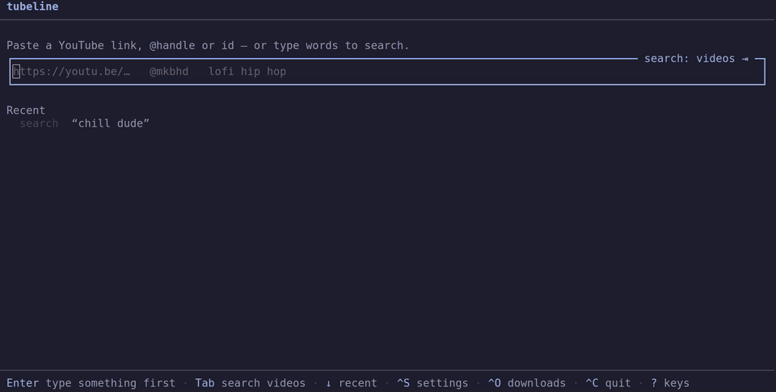
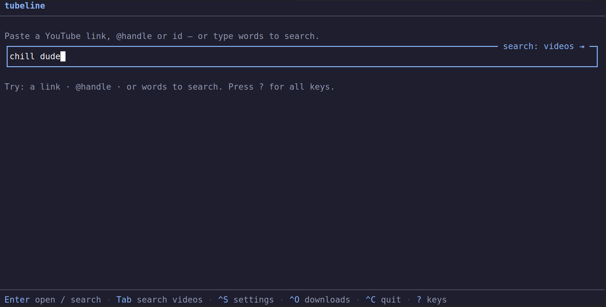
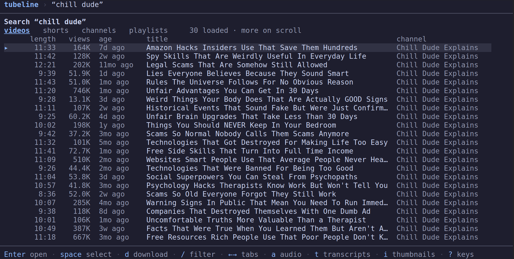
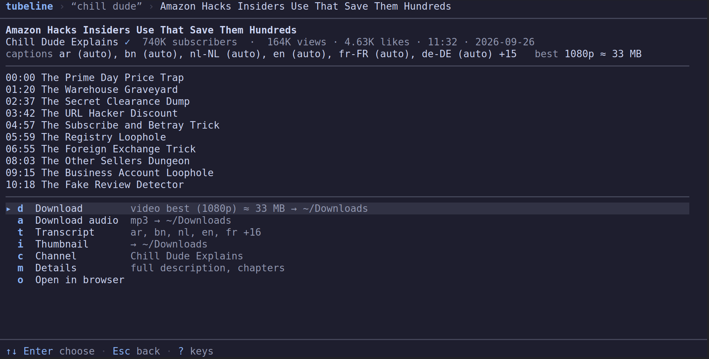
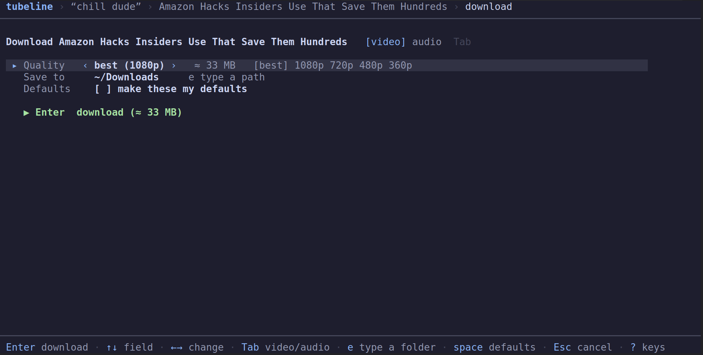
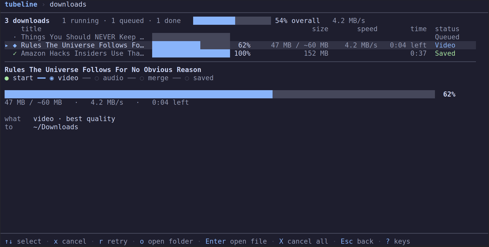
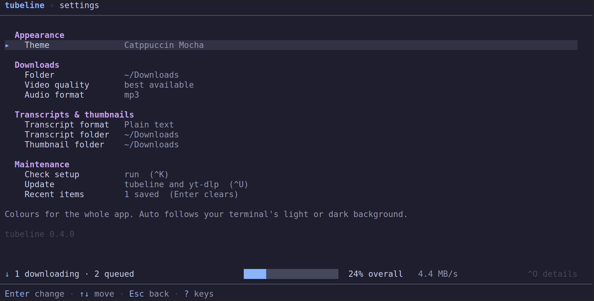

# tubeline

YouTube from the terminal: search, channel and video metadata, transcripts, thumbnails
and downloads. An interactive app for people, JSON for scripts and AI agents.



<details>
<summary>Screenshots</summary>
<br>

| | | |
|:-:|:-:|:-:|
| <a href="assets/home.png"></a><br>Home | <a href="assets/search.png"></a><br>Search | <a href="assets/video.png"></a><br>Video |
| <a href="assets/download.png"></a><br>Download panel | <a href="assets/downloads.png"></a><br>Downloads | <a href="assets/settings.png"></a><br>Settings |

</details>

## Install

```sh
curl -fsSL https://raw.githubusercontent.com/akashvaghela09/tubeline/main/install.sh | sh
```

A single binary for Linux, macOS and Windows. `tubeline update` keeps it and its
downloader ([yt-dlp](https://github.com/yt-dlp/yt-dlp)) current; install ffmpeg for
downloads above 360p.

## Use

```sh
tubeline                                   # interactive app — press ? for keys
tubeline search mkbhd iphone review
tubeline channel @mkbhd
tubeline videos @mkbhd -n 20
tubeline video dQw4w9WgXcQ
tubeline transcript dQw4w9WgXcQ --as txt
tubeline download dQw4w9WgXcQ --quality 1080p
```

Full reference: `tubeline docs`, `man tubeline` or [`docs/cli.md`](docs/cli.md).

## For scripts and AI agents

Output is JSON whenever stdout isn't a terminal, or with `--json`. Commands never prompt,
`--fields a,b.c` trims the output, and failures exit non-zero with
`{"error":{"code","message","hint"}}` on stderr. `tubeline schema <name>` prints the
JSON Schema of any output.

## Development

```sh
bun install && bun run dev -- channel @mkbhd    # Bun ≥ 1.4
bun test && bun run lint && bun run typecheck
```

See [`AGENTS.md`](AGENTS.md), [`docs/plan.md`](docs/plan.md) and
[`docs/releasing.md`](docs/releasing.md).

---

Uses undocumented YouTube endpoints; respect YouTube's terms and creators' rights.
[MIT](LICENSE)
